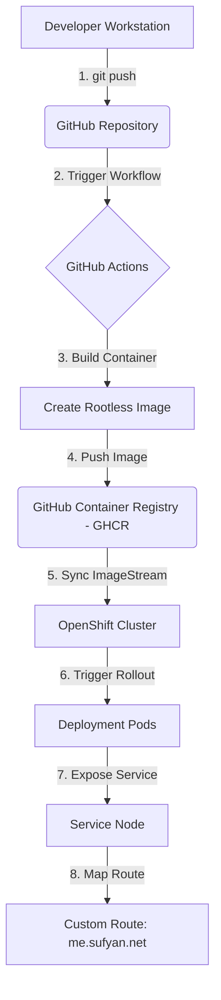

# DevOps & Pipeline Guide: Static Web Site to OpenShift

This guide outlines the end-to-end steps to code, containerize, version control, build, and deploy a responsive developer portfolio page to an **OpenShift** cluster using **GitHub Container Registry (GHCR)** and automated **ImageStream triggers** for Continuous Deployment (CD).

---

## 🏗️ Pipeline Architecture



---

## 📁 Project Directory Structure

Your project is structured as follows:
```text
portfolio-website/
├── index.html                  # Webpage codebase (HTML, CSS, JS terminal mockup)
├── Dockerfile                  # Container build instructions (unprivileged Nginx)
├── README.md                   # Setup summary documentation
├── pipeline_setup_steps.md     # This comprehensive step-by-step guide
├── .github/
│   └── workflows/
│       └── deploy.yml          # GitHub Actions build & push pipeline
└── openshift/
    ├── imagestream.yaml        # Tracks remote container image changes
    ├── deployment.yaml         # Openshift Deployment and Service configuration
    └── route.yaml              # Custom domain route definition (HTTP)
```

---

## 💻 Step 1: Coding the Web Site (`index.html`)

The homepage is built using a modern Developer & DevOps styling theme.
- **Embedded CSS**: Single-file layout for swift delivery.
- **Canvas Particles JS**: Floating background network connections.
- **SVG Rack Graphic**: Animated server rack LEDs flickering dynamically via CSS.
- **Mock CLI Terminal**: Fully functional bash mockup where you can type commands like `neofetch`, `skills`, `about`, `contact` and `help`.

*You can find the full code file in [index.html](file:///docker-data/projects/portfolio-website/index.html).*

---

## 📦 Step 2: Containerization (`Dockerfile`)

Since OpenShift blocks root user container privileges by default for security, the image uses an **unprivileged Nginx base** that binds to port `8080` instead of port `80`.

```dockerfile
FROM nginxinc/nginx-unprivileged:alpine

# Copy static website files to the default Nginx html serving directory
COPY index.html /usr/share/nginx/html/index.html

# Expose port 8080 (standard unprivileged port)
EXPOSE 8080

CMD ["nginx", "-g", "daemon off;"]
```

---

## 🐙 Step 3: Git Setup & Pushing to GitHub

Password authentication is disabled for GitHub operations. You must use a **Personal Access Token (classic)**.

### 1. Initialize and Commit Locally
Run this in your terminal:
```bash
git init
git config user.name "SysOpsXpert"
git config user.email "sufyan_60@hotmail.com"
git add .
git commit -m "feat: initial commit of portfolio and deployment manifests"
```

### 2. Configure Git with your Token
If your token is `<YOUR_GITHUB_TOKEN>`, bind the remote URL to bypass interactive password prompts:
```bash
git remote add origin https://<YOUR_GITHUB_TOKEN>@github.com/SysOpsXpert/portfolio-website.git
git branch -M main
```

### 3. Push to GitHub
```bash
git push -u origin main
```
> [!IMPORTANT]
> **Refused Workflow Error**: If the push returns a `refusing to allow a Personal Access Token to create or update workflow...` error, go to **GitHub > Settings > Developer settings > Personal access tokens (classic)**, click on your token, check the **`workflow`** scope checkbox, and update the token.

---

## 🤖 Step 4: GitHub Actions & GHCR Registry (`deploy.yml`)

The CI/CD pipeline is configured in `.github/workflows/deploy.yml`. When you push to `main`, it:
1. Logs into the **GitHub Container Registry (GHCR)** automatically using the built-in `${{ secrets.GITHUB_TOKEN }}`.
2. Builds the Docker container.
3. Pushes the image to: `ghcr.io/sysopsxpert/portfolio-website:latest`.

### Make the package Public (Crucial for OpenShift)
By default, newly uploaded packages in GHCR are **private**. To allow OpenShift to pull the image without configuring a registry credential secret:
1. Go to your GitHub profile Packages tab: `https://github.com/SysOpsXpert?tab=packages`.
2. Click on the `portfolio-website` package.
3. Open **Package settings** (bottom right).
4. Scroll down to **Change package visibility** and set it to **Public**.

---

## 🔑 Step 5: Logging into the Registry locally

If you ever need to build, tag, and push container images manually from your terminal instead of using GitHub Actions:

1. **Log in via Stdin** (avoids escaping issues):
   ```bash
   echo "<YOUR_GITHUB_TOKEN>" | docker login ghcr.io -u SysOpsXpert --password-stdin
   ```
2. **Build and Tag**:
   ```bash
   docker build -t ghcr.io/sysopsxpert/portfolio-website:1.0 .
   ```
3. **Push to GHCR**:
   ```bash
   docker push ghcr.io/sysopsxpert/portfolio-website:1.0
   ```
> [!IMPORTANT]
> If you get a `denied: denied` response during login, make sure your GitHub token classic scopes has **`write:packages`** and **`read:packages`** checked.

---

## ☸️ Step 6: Deploying to OpenShift

We utilize the custom manifests under the `openshift/` directory.

### 1. The Deployment & Service (`openshift/deployment.yaml`)
Deploys 2 replicas of your website container and opens an internal cluster port on port 80:
```yaml
apiVersion: apps/v1
kind: Deployment
metadata:
  name: portfolio-website
  namespace: portfolio-project
  annotations:
    image.openshift.io/triggers: '[{"from":{"kind":"ImageStreamTag","name":"portfolio-image:latest"},"fieldPath":"spec.template.spec.containers[?(@.name==\"web\")].image"}]'
  labels:
    app: portfolio-website
spec:
  replicas: 2
  selector:
    matchLabels:
      app: portfolio-website
  template:
    metadata:
      labels:
        app: portfolio-website
    spec:
      containers:
      - name: web
        image: ghcr.io/sysopsxpert/portfolio-website:latest
        imagePullPolicy: Always
        ports:
        - containerPort: 8080
---
apiVersion: v1
kind: Service
metadata:
  name: portfolio-service
  namespace: portfolio-project
spec:
  selector:
    app: portfolio-website
  ports:
  - protocol: TCP
    port: 80
    targetPort: 8080
```

### 2. Custom Route (`openshift/route.yaml`)
Exposes the application to external traffic under your custom hostname:
```yaml
apiVersion: route.openshift.io/v1
kind: Route
metadata:
  name: portfolio-route
  namespace: portfolio-project
  labels:
    app: portfolio-website
spec:
  host: me.sufyan.net
  to:
    kind: Service
    name: portfolio-service
  port:
    targetPort: 80
```

---

## 🤖 Step 7: Automated Deployment Updates (Continuous Deployment)

We automate updates pull-style using **OpenShift ImageStreams**.

### 1. ImageStream (`openshift/imagestream.yaml`)
Configures the cluster to poll GHCR for updates:
```yaml
apiVersion: image.openshift.io/v1
kind: ImageStream
metadata:
  name: portfolio-image
  namespace: portfolio-project
spec:
  tags:
  - name: latest
    from:
      kind: DockerImage
      name: ghcr.io/sysopsxpert/portfolio-website:latest
    referencePolicy:
      type: Source
    importPolicy:
      scheduled: false # Set to false to disable automatic registry polling
```

### 2. How to apply this setup in OpenShift
Logged into OpenShift CLI, run:
```bash
oc new-project portfolio-project
oc apply -f openshift/imagestream.yaml
oc apply -f openshift/deployment.yaml
oc apply -f openshift/route.yaml
```

### 3. Manual Verification & CD Execution:
1. Make a code change in `index.html`.
2. Push to GitHub: `git add . && git commit -m "update code" && git push`.
3. GitHub Actions builds the image and pushes it to GHCR *only if index.html was modified*.
4. **Trigger Deployment Manually**: Import the new image to OpenShift to apply the update immediately:
   ```bash
   oc import-image portfolio-image -n portfolio-project
   ```
   *OpenShift will detect the import changes and initiate a rolling restart of the pods.*
